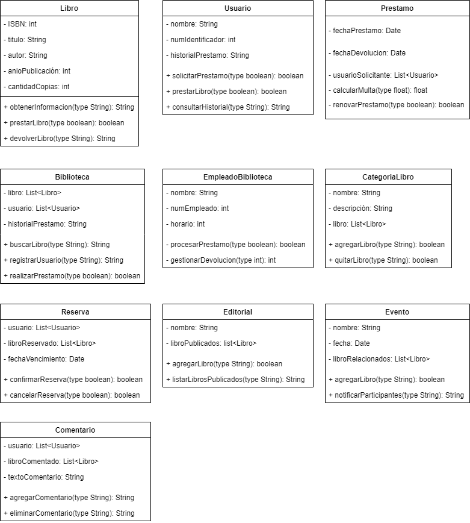

# Sistema de Gestión de Biblioteca (Proyecto)

Desarrolla un sistema de llamado Gestión de Biblioteca que permita a los bibliotecarios 
buscar, prestar y devolver libros en una biblioteca. El sistema debe tener una interfaz 
de usuario simple (Main con menú) y proporcionar funcionalidades básicas de administración 
de libros, como: (obtenerInformacion(identificadorLibro), prestarLibro(identificadorLibro), 
devolverLibro(identificadorLibro), agregarComentario(identificadorLibro), 
consultarComentarios(identificadorLibro), verificarDisponibilidad(identificadorLibro)). 
Además, el sistema permitirá dar de alta/modificación/búsqueda/eliminación de usuarios y libros.

## Indice

- [Diagrama de casos de uso](#casos-de-usos)
- [Diagrama de clases](#clases)

## Diagrama de casos de usos 

### Actores:

### Casos de usos:

### Diagrama:

## Diagrama de clases 

### Clases:

### Diagrama:

